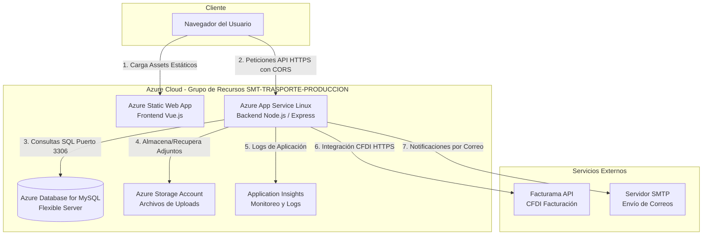

# 05 — Arquitectura Utilizada

Este documento describe la arquitectura de software e infraestructura sobre la cual opera el sistema **VTP Transporte**, detallando las responsabilidades de sus componentes, los flujos de comunicación y su despliegue en Microsoft Azure.

---

## 1. Vista General de la Arquitectura

El sistema utiliza una arquitectura desacoplada basada en servicios administrados en la nube de Azure (PaaS/SaaS). El frontend (aplicación SPA en Vue.js) y el backend (servidor Node.js/Express) operan de forma independiente y se comunican a través de solicitudes HTTPS.

### Diagrama de Arquitectura (Mermaid):

---

## 2. Componentes Principales y Responsabilidades

### A. Frontend (Azure Static Web App)
- **Tecnología:** Vue.js 3 compilado por Vite.
- **Responsabilidad:** Presentación de la interfaz de usuario, enrutamiento en el cliente, gestión de estados y peticiones hacia el backend.
- **URL Productiva:** `https://blue-bush-0d9760810.7.azurestaticapps.net`

### B. Backend (Azure App Service - Plan B1)
- **Tecnología:** Node.js 22 LTS, Express.js.
- **Responsabilidad:** Procesar la lógica de negocio, exponer los endpoints REST API, autorizar peticiones mediante JWT, ejecutar jobs programados de facturación y alertas, interactuar con la base de datos y consumir servicios externos.
- **URL Productiva:** `https://smt-transportes-api.azurewebsites.net`

### C. Base de Datos (Azure Database for MySQL Flexible Server)
- **Tecnología:** MySQL v8.0 de tipo servidor flexible.
- **Responsabilidad:** Almacenar de forma persistente y relacional la información del negocio (viajes, usuarios, facturas, clientes, catálogos del SAT).

### D. Almacenamiento (Azure Storage Account)
- **Servicio:** Azure Blob Storage (contenedor `vtptransporte-archivos`).
- **Responsabilidad:** Guardar archivos cargados por los usuarios (documentos, imágenes de evidencia de viajes, archivos XML/PDF de facturación).

---

## 3. Flujo de Comunicación y Seguridad

1. **Protocolo Obligatorio:** Todo el tráfico viaja cifrado bajo HTTPS (`httpsOnly: true` en el App Service).
2. **CORS:** El frontend se comunica con el backend cruzando dominios. El backend valida el encabezado `Origin` de la petición contra la lista blanca configurada en `CORS_ALLOWED_ORIGINS` y responde en consecuencia (como se detalla en [03-solucion-implementada.md](./03-solucion-implementada.md)).
3. **Autenticación:** Las rutas protegidas del backend requieren una cabecera `Authorization: Bearer <JWT_TOKEN>` generada tras un inicio de sesión exitoso.
4. **Firewall de Base de Datos:** La base de datos MySQL Flexible Server tiene habilitada la opción de restringir accesos, permitiendo peticiones únicamente desde el bloque de IPs internas de los servicios de Azure (permitiendo que el App Service se conecte y bloqueando intentos externos no autorizados).

---

## 4. Gestión de Configuración y Secretos

- **Variables de Entorno:** El App Service almacena toda la configuración en su panel de "Configuración de la Aplicación" (App Settings). Estas variables son inyectadas en tiempo de ejecución al contenedor de Node.js.
- **Secretos en IaC:** Las contraseñas de la base de datos y la llave secreta de JWT se administran en Bicep como parámetros seguros (`@secure()`). Bicep evita escribir estos valores en los registros del despliegue.

---

## 5. Diferencias entre Ambientes

### Ambiente de Desarrollo Local:
- **Frontend:** Corre localmente en `http://localhost:5173`.
- **Backend:** Corre en `http://localhost:3000`.
- **Base de Datos:** MySQL local o instancia remota sin SSL obligatorio (`DB_SSL=false`).
- **CORS:** Se simula mediante el proxy reverso de Vite (`vite.config.js`), redirigiendo `/api` a `http://localhost:3000`.

### Ambiente de Producción (Azure):
- **Frontend:** Desplegado en Azure Static Web Apps.
- **Backend:** Alojado en Azure App Service Linux.
- **Base de Datos:** Azure Database for MySQL con conexión segura obligatoria (`DB_SSL=true`).
- **CORS:** Manejado por el middleware en Express con validación estricta de dominios de producción.
